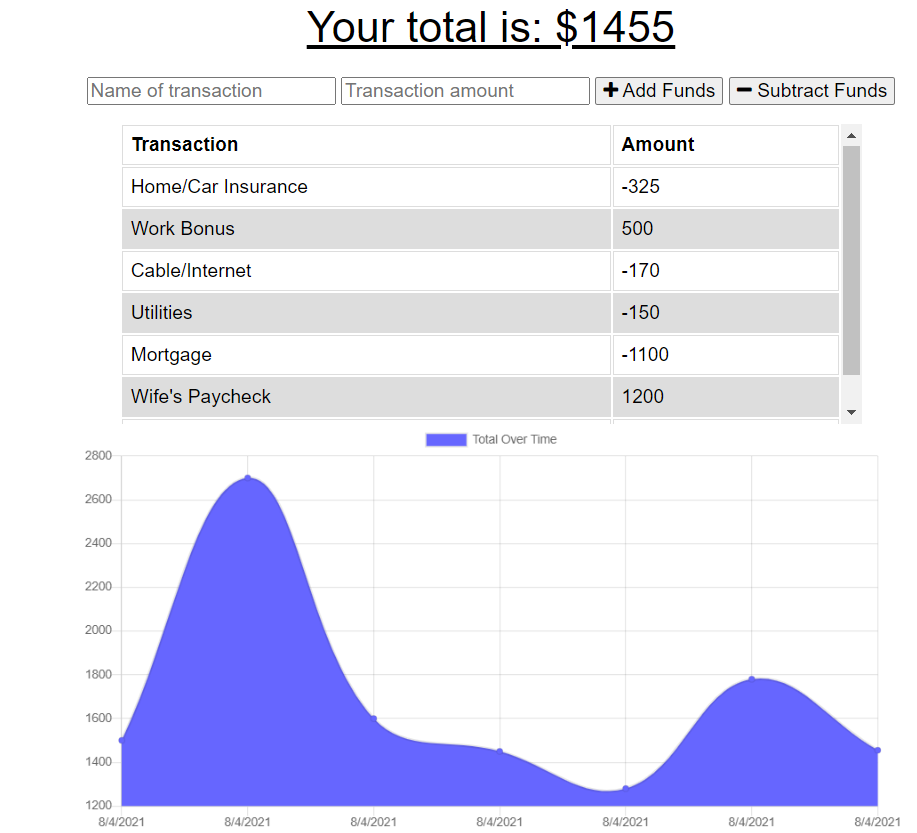
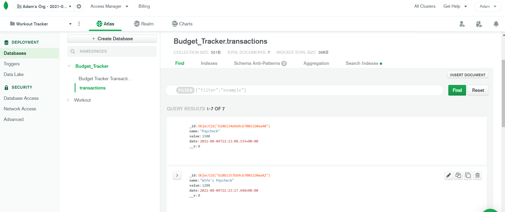

# Progressive-Budget-Tracker :dollar::moneybag:

## Table of Contents :books:

1.  [Description](#Description)
2.  [Installation](#Installation)
3.  [Project Usage](#Project-Usage)
4.  [License Information](#License-Information)
5.  [Contributors](#Project-Contributors)
6.  [Testing Instructions](#Testing-Instructions)
7.  [Heroku Application Link](#Heroku-Application-Link)
8.  [Screenshots](#Screenshots)
9.  [Contact Info](#Questions)

 

## Description :money_with_wings:

This Progressive Web Application is a Budget Tracker which allows for the user to enter transactions (by adding or subtracting funds w/ a titled transaction). Regardless if the user is connected online or if they are offline, the application allows the user's transactions to be saved and referred back to later. The application allows for the user to maintain an ongoing account balance, without worry of an online connection.

 

## Installation :hammer_and_wrench:

_Application Dependencies Include_

- Compression
- Express
- Lite-Server
- Mongoose
- Morgan
- MongoDB Atlas
- Heroku

_Files Created to Make PWA Budget Tracker Functional Include_

- **manifest.webmanifest** - Provides information about this PWA in a JSON text file which is necessary for the app to be downloaded and be presented to the user similarly to the native app. (i.e you can download the app to your home screen of whatever device and have the same clean presentation)

- **service-worker.js** - This file is a script which the browser runs in the background that is essentially a JavaScript file that caches all of the Budget Trackers data and retrieves resources from the cache. You can view the included files in the app's cache here (all the public folders).

- **indexdb.js** - This file allows for the Budget Tracker to have dynamic content by allowing for the user to input withdraws or deposits, offline, and have those transactions automatically uploaded when back online. This file works with the Budget Tracker DB and creates a Budget Tracker Store to hold all of the inputted user transactions. In essence, this file creates a "waiting room" for the transactions to interact with the application.

_Additional Install Instructions Include_

- Run NPM Install to utilize package.json dependencies
- server.js file was updated to reflect a const PORT with the process.env path, along with the proper syntax to connect to our Mongoose DB.
- index.html file = link to manifest.webmanifest was included in head of document, along with scripts for the indexdb.js and service worker (both at the base of the index.html)
- Utilizing MongoDB Atlas and Heroku, a Budget_Tracker database was created and then linked for proper deployment.

 

## Project Usage :heavy_dollar_sign::bar_chart:

_User Story_ 

AS AN avid traveller
I WANT to be able to track my withdrawals and deposits with or without a data/internet connection
SO THAT my account balance is accurate when I am traveling. 

Giving users a fast and easy way to track their money is important, but allowing them to access that information anytime is even more important. Having offline functionality is paramount to our applications success. 

The user will be able to add expenses and deposits to their budget with or without a connection. When entering transactions offline, they should populate the total when brought back online.

 

## License Information :ticket::copyright:

The MIT License is a permissive free software license originating at the Massachusetts Institute of Technology in the late 1980s. As a permissive license, it puts only very limited restriction on reuse and has, therefore, high license compatibility.

 

## Project Contributors :man_technologist:

Adam Spiegel 
Full Stack Web Developer 
https://www.linkedin.com/in/adam-spiegel-3086687/

 

## Testing Instructions :technologist:

1. Follow the Heroku app link located below.
2. Enter any transactions, withdraws or deposits, and you should see the chart auto populate your data.
3. Go into browser dev tools, and disconnect from network. Try adding in withdraws and deposits. These will be saved via the indexdb.js file, and when you reconnect via the dev tools, the transactions will automatically load to the Budget_Tracker Mongoose database.
4. Please feel free to clone the repo to test on your local machine. You will need to NPM I for the dependencies, and make sure you are connected to Mongod to run properly.

 

## Heroku Application Link :computer::computer_mouse:

### **https://warm-fortress-83074.herokuapp.com/**

 

## Screenshots - Online & Offline :chart_with_upwards_trend:

## Questions? :raising_hand_man:

### Please find my contact information below to reach out!

 
